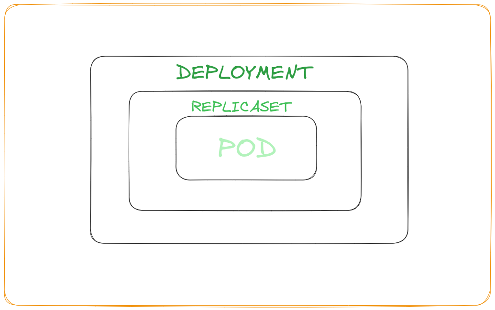

# Deployments in K8's

- A Deployment provides declarative updates for Pods and ReplicaSets.

- There are many types of Deployments Strategy out of which Default is ``Rolling Updates``

## ``Rolling Updates``

- If we do not want to upgrade all PODS at once as it will give us **DOWNTIME** and if we do not want that we should follow the startegy of ``Rolling Updates`` in which the Pods are replaced serially.
- We do not want to apply change immediately we want to make a chnage to env; make changes and resume so that all changes are rolled out together.



- Sample Syntax [Same as that of ReplicaSet] - It will create the PODs and RepicaSets
```
apiVersion: apps/v1
kind: Deploynment
metadata:
  creationTimestamp: null
  labels:
    run: nginx-pod
  name: nginx-pod
spec:
  containers:
  - image: nginx:alpine
    name: nginx-pod
    resources: {}
replicas: 3
selector:
  matchLabels:
    type: front-end
```

- It is very similar to ReplicaSet just as the kind: Deployment
- When it applied it will create a new K8's object called as Deployment

```
# TO create a deployment
kubectl create -f deployment.yaml

# To get all deployments
kubectl get deployments
kubectl get deploy

# To get replicasets
kubectl get replicasets
kubectl get rs

# To get pods
kubectl get pods

# To create deployment 
kubectl get deployment --image=nginx --dry-run=client -o yaml > nginx-pod.yaml
```

