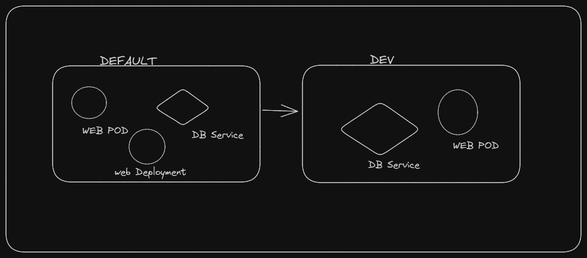

# Namespaces in K8

- **It is used to isolate the resources among the usergroups**
- By default the default namespaces is **DEFAULT**
- Namespaces are used to provide the isolation.
- If we want to use the same cluster within the Dev and Production Environment then we need to create the Dev and Production Namespaces
- We can set the **RESOURCE QUOTAS** for each namespaces so that each namespace will get a guaranteed certain amount and not use more than the allowed limit.



### What if web pod in the Default want to interact with the Db Service in Default namespace?
- YES IT CAN; via mysql.connect("db-service")

### What if the web pod in the Default NS wants to interact it with DB service in DEV namespace ?
- YES IT CAN; via the mysql.connect("db-service.dev.svc.cluster.local")
- SO the foramt lies like mysql.connect(<service-name>.<namespace>.<service>.<DOMAIN>)
- <DOMAIN>=cluster.local in our case


## Commands in the NAMESPACES:

```
#TO get namespaces
kubectl get namespaces

#To get pods from particular namespaces
kubectl get pods --namespace kube-system

# To create a namespace
kubectl create namespace dev

#To create pods in the new namesapces which is not created yet
kubectl create -f pod-definition.yml --namespace=dev
```

## YML SYNTAX for namespace

```
ns-dev.yml

apiVersion: v1
kind: Namespace
metadata:
  name: dev

```
### Can we set other context to other namespace other than the default ?
- **YES we can**, we need to use the contxt switching in the namespace.
- ``kubectl config set-context $(kubectl config current-context --namespace=dev)``
- It will set the default context as the namesapce dev and now to switch to the default namespace we need to explicitly mention it as --namespace=default


# ``Resource Quota``

- To limit ceratin resources in the Namespace we need to provide the "Resource Quota" here.

```
res-quota.yml

apiVersion: v1
kind: ResourceQuota
metadata:
  name:compute-quota
  namespace: dev

spec: 
  hard:
    pods: "10"
    requests.cpu: "4"
    requests.memory: "5Gi"
    limits.cpu: "10"
    limits.memory: "10Gi"

```
