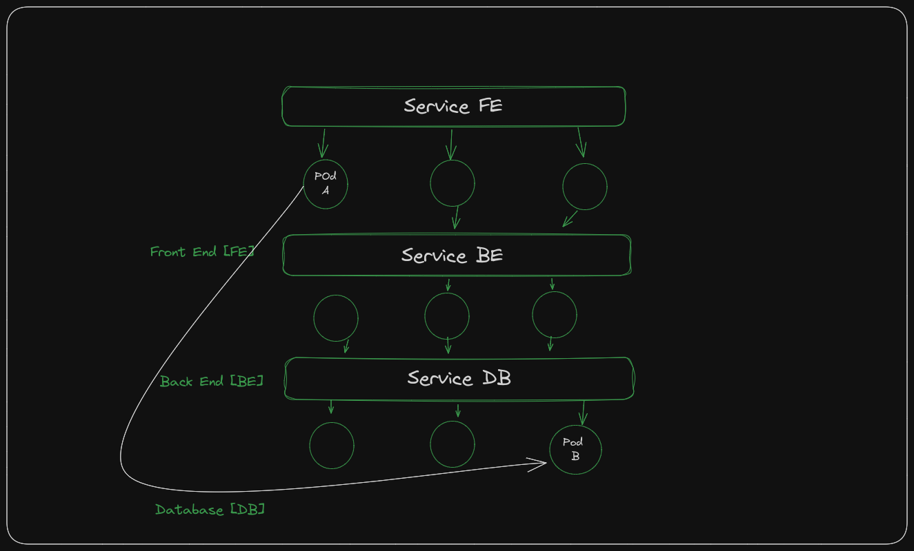

# K8 Services

## These helps us  to provide loose couplings in our Microservices in our Applications.
- It help helps to connect one app to another app sor users.
- ``K8's Service`` is an K8's Object; one of its usecase is to list to a PORT on NODE and Forward request to a PORT running a webapp.

# - There are ``3 types`` of Services
# - ``NODE PORT``
# - ``CLUSTER IP``
# - ``LOAD BALANCER``

# ``NODE PORT SERVICE`` - 
- In NDOE PORT service it helps to map the PORT on NODE : PORT ON POD 
- PORT on POD is called as "Target PORT"
- PORT on SERVICE is called as "PORT"
- PORT on NODE is called as "NODE PORT"
- NODE PORT has the valid range from ``30000 to 32767``

- **NOTE**: If we do not provide a NODEPORT then it K8;s will choose a value in between the ranges 30000 to 32767 ``randomly``.

- **NOTE**: If we do not provide a TARGETPORT then it K8's then Target is assumed to be same as that of the port of POD(POD).

service-definition.yml
```
apiVersion: v1
kind: Service
metadata:
  creationTimestamp: null
  labels:
    app: new-service
  name: new-service
spec:
  ports:
  - name: 80-80
    port: 80
    protocol: TCP
    targetPort: 80
  selector:
    app: new-service
  type: NodePort
status:
  loadBalancer: {}
```
## Commands in Services

```
# To create the service 
kubectl create service <service-type> <port-to-run-on> <service-name> -o yaml --dry-run=client > <file-to-put>.yaml
kubectl create service nodeport --tcp 80:80 new-service -o yaml --dry-run=client > service.yaml

# To get the service
kubectl get service
kubectl get svc

```

## Q. What if in the case of multiple POD's on Single Node then? (For HA, For LB Purpose)
- As when we are targetting each POD with the same labels in the service and service is created it also uses the same label
- So when service will look for matching POD with label and finds multiple of them; the service automatically selects them as endpoints to forward external request coming from user.
```
# For all the pods
labels:
  app: new-service

# For the service
apiVersion: v1
kind: Service
metadata:
  creationTimestamp: null
  labels:
    app: new-service
  name: new-service
spec:
  ports:
  - name: 80-80
    port: 80
    protocol: TCP
    targetPort: 80
  selector:
    app: new-service
  type: NodePort
status:
  loadBalancer: {}
```

## What algorithm does it use to  distribute service/ load ?
- It uses a ``Random Load Balancer Alogorithm``; here actually service inturn acts as a LoadBalancer to distribute load across different POD's

## What if we have multiple NODES on different NODES ?
- K8's will actually create the service which aspans across all Nodes in the Cluster.
- It will also map the ``same NodePort`` across all the Nodes in the Cluster. So we can access the app using <IP-of-NODEr>:<PORT-OF-NODE>
- Even when POD's are removed/added the service is automatically updated; once created we do not make any additional K8 Configuration chnages for servies.

# ``CLUSTER IP SERVICE``

- To establish the connectivity between the tiers [Front End, Back End, Database] we use the ClusterIP Services.
- It is also the default type of service

## Pods alos have IP's so can we use them to make a connection ?
- **NO** Should not use the POD IP's as if the Pods get down the IP will also change in that case
- The solution is to provide the K8's service and provide a single interface to access POD in a group



## What if the POD A Want to communicate to the POD B then what should it do ?
- The request will go to the service DB and then the Service DB will forwar it to the POD B
- Here this Cluster Service helps to scale our MicroServices; each service will get its own IP and Name Assigned to it; the name should be used by other PODs to access services this type of service called as ``Cluster IP``.

```
apiVersion: v1
kind: Service
metadata:
  creationTimestamp: null
  labels:
    app: new-service
  name: new-service
spec:
  ports:
  - port: 80 # Port of the POD [Where BE is exposed]
    targetPort: 80 # Port where service is exposed
  selector:
    app: new-service
  type: ClusterIP
status:
  loadBalancer: {}
```
# ``Load Balancer Service``
- ``Scenario``

- **What if external user want to acces our App and it is  shared across different nodes?**
- **User do not want to have the user <IP>:<PORT> each time they want to acces the App**

- The solution is to use the Load Balancer Service.

- This type of  service is only supoported only when the Load balancer is natively available like AWS, Azure, GCP

```
apiVersion: v1
kind: Service
metadata:
  creationTimestamp: null
  labels:
    app: new-service
  name: new-service
spec:
  ports:
  - name: 80-80
    port: 80
    protocol: TCP
    targetPort: 80
  selector:
    app: new-service
  type: NodePort
status:
  loadBalancer: {}
```